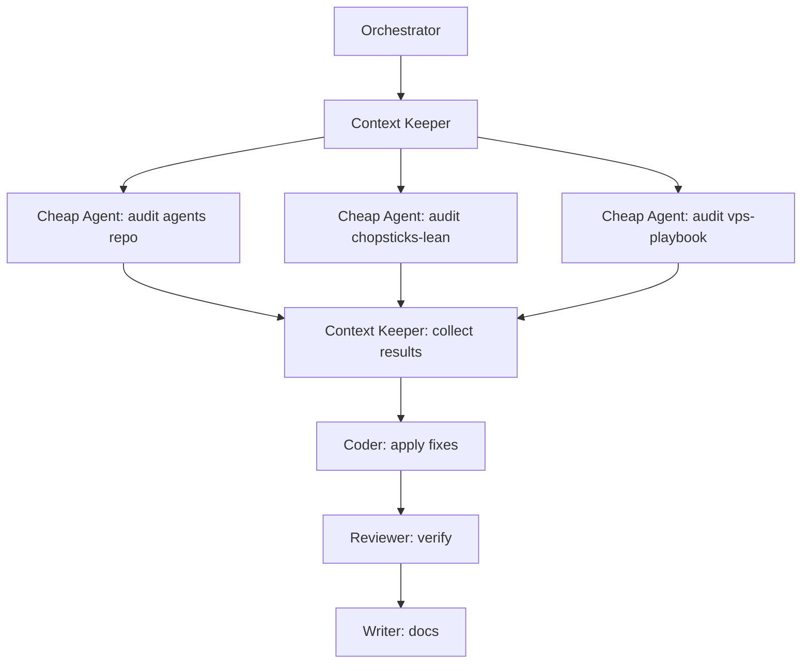

<div align="center">

# Mad House Agents

**Every AI agent built by Mad House — in one place.**


</div>

---

All the Mad House agents live here. Each one is a `.agent.md` file — a YAML frontmatter block plus a behavior spec that Copilot, Claude, Gemini, Codex, OpenClaw, or any compatible agent runner can pick up and map into its own tool system.

You don't run agents from this repo directly. You copy the file you want into the discovery path your agent runner expects. For VS Code Copilot that is `.github/agents/`. Other runners can ingest the same file and map the portable tool aliases to their own capabilities.

> [!TIP]
> Not sure which agent to use? The `argument-hint` field in each file's frontmatter tells you exactly what to pass when invoking it.

---

## Don't Feel Like Reading?

Drop this repo into any AI assistant — Claude, ChatGPT, Copilot, whatever you use — and ask it to explain any agent, help you pick the right one, or walk you through adding agents to your repo. Everything it needs is already here.

---

## Agents

### Command & Control

| Agent | What it does |
|---|---|
| [delegator.agent.md](./agents/delegator.agent.md) | Your single entry point for everything. Describe what you want in plain language — the Delegator reads it, picks the right agents, and dispatches them in the right order. You never need to call individual agents directly. |
| [orchestrator.agent.md](./agents/orchestrator.agent.md) | Runs the fleet. Breaks large or cross-cutting work into agent-sized tasks, dispatches in the right order, collects outputs, and delivers a unified result. Use when the work is too big for one agent. |
| [librarian.agent.md](./agents/librarian.agent.md) | Keeps the whole Mad House repo ecosystem in order. Unified branding, consistent wording, cross-repo ref sync, org-wide health reports. Coordinates all other agents. Librarians don't play. |
| [context-keeper.agent.md](./agents/context-keeper.agent.md) | Solves the compaction problem. Writes and maintains living state files — session logs, decision records, handoffs — so any agent picking up the work can continue without losing ground. Required for multi-session and multi-agent work. |

### Code

| Agent | What it does |
|---|---|
| [coder.agent.md](./agents/coder.agent.md) | Writes and changes production code. Implementation, fixes, migrations, scripts, wiring. Read first, minimal correct change, verified output. No scope creep. |
| [debugger.agent.md](./agents/debugger.agent.md) | Finds out why something is broken. Systematic fault isolation — reads the failure, forms hypotheses, tests them, finds root cause, fixes it, verifies. |
| [reviewer.agent.md](./agents/reviewer.agent.md) | Reviews code before it merges. Checks correctness, security, patterns, tests, and ops impact. Produces actionable findings, not style opinions. |

### Workflow & Ops

| Agent | What it does |
|---|---|
| [git-keeper.agent.md](./agents/git-keeper.agent.md) | Version control workflow — branching strategy, conventional commits, staging discipline, PR descriptions, merge strategy, and keeping the git history clean and human. |
| [auditor.agent.md](./agents/auditor.agent.md) | Deep structured audit of any repo, service, docs, or environment. Scored findings — CRITICAL to LOW — with exact fixes. |
| [updater.agent.md](./agents/updater.agent.md) | Acts on audit findings. Works through them one at a time, verifies each change, keeps a log. Paired with the auditor. |
| [security.agent.md](./agents/security.agent.md) | Security-focused audit. OWASP Top 10, secrets in code and git history, auth gaps, injection surfaces, vulnerable deps, infra exposure. Exact findings, exact fixes. |
| [playbook-builder.agent.md](./agents/playbook-builder.agent.md) | Turns repeated chat guidance into a real repo, runbook set, or playbook. Use when something keeps getting re-explained in conversation. |
| [vps-maintenance-planner.agent.md](./agents/vps-maintenance-planner.agent.md) | VPS maintenance planning — runtime inspection, topology updates, runbooks, and safe change sequences for the live Mad House server. |

### Writing & Documentation

| Agent | What it does |
|---|---|
| [writer.agent.md](./agents/writer.agent.md) | Rewrites any doc, README, or prose to sound like a person wrote it. Applies the Mad House humanized writing standard — no jargon, no filler, no corporate voice. |
| [beautiful-readme.agent.md](./agents/beautiful-readme.agent.md) | Writes GitHub READMEs with centered heroes, real badges, callout blocks, mermaid diagrams, and feature grids. No bullet wallpaper. |

### Bot Development

| Agent | What it does |
|---|---|
| [bot-dev-playbook.agent.md](./agents/bot-dev-playbook.agent.md) | Mad House Discord bot development workflow — standards, handoffs, and coordination across bot repos. |

### Sites & Product Pages

| Agent | What it does |
|---|---|
| [site-architect.agent.md](./agents/site-architect.agent.md) | Turns rough site ideas into build-ready page briefs — audience, CTA stack, page map, section specs, and asset needs. |
| [site-designer.agent.md](./agents/site-designer.agent.md) | Translates a site brief into visual direction, section layout, interaction notes, and copy structure for enterprise-style pages. |
| [site-builder.agent.md](./agents/site-builder.agent.md) | Implements landing pages, marketing site sections, and docs-home surfaces in code from an approved brief and design direction. |

---

## How to Use an Agent

Drop the `.agent.md` file into your runner's discovery path. In VS Code Copilot that is `.github/agents/`.

```bash
# Clone and copy the agents you want
git clone https://github.com/madebymadhouse/agents.git
cp agents/agents/coder.agent.md your-repo/.github/agents/
cp agents/agents/reviewer.agent.md your-repo/.github/agents/
cp agents/agents/context-keeper.agent.md your-repo/.github/agents/
```

Then invoke by name in chat:

```
@orchestrator do a full pass on all Mad House repos
@coder add rate limiting to the /warn command in src/commands/mod.js
@debugger the bot crashes on startup — here's the stack trace: [paste]
@reviewer review the changes in src/commands/economy.js
@security audit this repo — scope: secrets + auth + deps
@context-keeper write the handoff for this session
@librarian full unification pass across all repos
@site-architect shape the homepage for a developer tool around its core substrate and onramp
@site-designer turn this site brief into a dark enterprise AI landing page direction
@site-builder implement the new hero and feature sections in src/app/page.tsx
```

---

## Fleet Pattern: Cheap Autonomous Agents

The Orchestrator + Context Keeper are designed to support a team of low-cost, limited-context agents working in parallel. The pattern:



The Context Keeper writes each cheap agent a targeted handoff with only what it needs. The agents work narrow tasks autonomously. The Orchestrator collects and integrates. Nothing gets forgotten because the state lives in files, not in any agent's context window.

---

## Agent Format

Every agent follows this format:

```markdown
---
name: Agent Name
description: One sentence. When to reach for this agent and what it does.
tools: [read, search, execute, edit, todo, agent]
user-invocable: true
argument-hint: What to tell the agent when invoking it.
---

[Behavior specification — required reads, goals, constraints, process, output format]
```

Use Copilot tool aliases in frontmatter unless you have a specific extension tool you truly need. Prefer small sets like `read`, `search`, `execute`, `edit`, `web`, `todo`, and `agent` over giant tool dumps.

These aliases are the portable core of the repo. Copilot recognizes them directly, and other runners can map them without changing the agent body.

See [PORTABILITY.md](./PORTABILITY.md) for the cross-platform contract.

---

## Adding a New Agent

1. Create `agents/your-agent-name.agent.md`
2. Follow the format above
3. Add a row to the right table in this README
4. Open a PR — see Contributing below

## Workspace Extras For Site Work

This repo also includes site-building workflow files for VS Code Copilot:

- `.github/instructions/site-build.instructions.md`
- `.github/prompts/site-build-pass.prompt.md`

Drop these into your repo alongside the site agents for a consistent build workflow.

> [!TIP]
> Use `@playbook-builder` to design a new agent before writing it. Define scope, constraints, and output format before committing to a shape.

---

## Mad House Repos

| Repo | What it is |
|---|---|
| [madebymadhouse/agents](https://github.com/madebymadhouse/agents) | This repo — all agents |
| [madebymadhouse/bot-dev-playbook](https://github.com/madebymadhouse/bot-dev-playbook) | Shared workflow and standards for Discord bot development |
| [madebymadhouse/vps-maintenance-playbook](https://github.com/madebymadhouse/vps-maintenance-playbook) | VPS maintenance notebook for the live server |
| [madebymadhouse/chopsticks-lean](https://github.com/madebymadhouse/chopsticks-lean) | The live Mad House Discord bot |

---

## Contributing

New agents are welcome. The bar is: does it do one thing well, does it know when to stop, and does it coordinate cleanly with the rest of the fleet?

**To contribute an agent:**
1. Fork this repo
2. Create `agents/your-agent-name.agent.md`
3. Follow the agent format — YAML frontmatter, clear `argument-hint`, defined process, hard rules at the end
4. Test it — invoke it on a real task and verify the output is what the spec says it should be
5. Add it to the right table in this README
6. Open a PR with a one-line description of what it does and what gap it fills

**Standards that apply:**
- One agent, one job. No agent does code AND writes docs.
- Every agent has hard rules. These are the things it refuses to do even if asked.
- Output format is always specified. Not "produces a report" — shows the exact template.
- Agents coordinate, not compete. If your agent's scope overlaps with an existing one, either sharpen the scope or merge it.

**The Librarian runs a unification pass before any PR merges.** Expect feedback on naming, branding, and cross-agent consistency.

---

## License

[MIT](./LICENSE)
